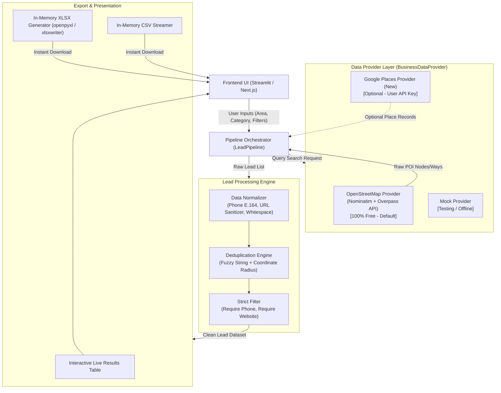
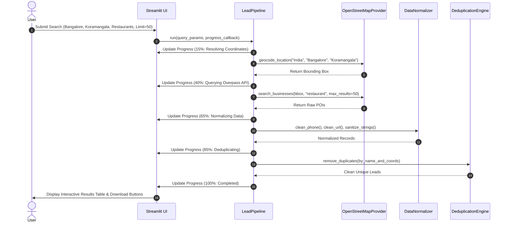

# System Architecture & Technical Specifications

## 1. High-Level Architecture Overview



---

## 2. Technology Stack & Rationale

| Component | Selected Technology | Alternative Considered | Rationale | Cost |
| :--- | :--- | :--- | :--- | :--- |
| **Language** | Python 3.11 - 3.14 | TypeScript / Node.js | Fast data processing, pandas, xlsxwriter, rich ecosystem | **$0** (FOSS) |
| **User Interface** | Streamlit | Next.js + React | Zero boilerplate, native live progress reporting, built-in data editor/table, direct memory-buffered downloads | **$0** (FOSS) |
| **Primary Free Source** | OpenStreetMap (Overpass + Nominatim) | Direct Google Scraping | Legal, stable, unmetered, no credit card or API key required | **$0** (FOSS) |
| **Google Maps Source** | Serper API (Google Maps & Places) | Google Cloud Places API | 2,500 free queries, no credit card required, verified Google phone numbers | **$0** (Free Tier) |
| **Optional Data Source** | Google Places API (New) | Direct Scraping | Official GCP API if user brings billing-enabled key | **$0** (Pay-as-you-go) |
| **Data Processing** | Python `pandas` & regex | Custom JS arrays | Vectorized deduplication, fast phone and string cleaning | **$0** (FOSS) |
| **Spreadsheet Engine**| `xlsxwriter` / `openpyxl` | SheetJS | High performance Excel generation with cell styling, auto-width, frozen headers | **$0** (FOSS) |
| **Deployment Target** | Render Free Tier (Web Service / Docker) / Streamlit Cloud | Vercel / AWS | Native free hosting tier, no credit card required on Streamlit Cloud, straightforward on Render | **$0** |

---

## 3. Provider Abstraction (`BusinessDataProvider`)

To ensure the system never locks into a single source or breaks if an API changes, all data retrieval is decoupled behind an abstract base interface:

```python
from abc import ABC, abstractmethod
from typing import List, Dict, Any, Optional

class BusinessDataProvider(ABC):
    @abstractmethod
    def geocode_location(self, country: str, city: str, area: str) -> Optional[Dict[str, float]]:
        """Resolves country/city/area to bounding box and lat/lon coordinates."""
        pass

    @abstractmethod
    def search_businesses(
        self,
        bounding_box: Dict[str, float],
        category: str,
        keyword: Optional[str] = None,
        max_results: int = 50,
        progress_callback = None
    ) -> List[Dict[str, Any]]:
        """Fetches raw business entities within the bounding box."""
        pass
```

### 3.1. Provider 1: OpenStreetMap (Overpass QL) [Default - 100% Free]
- **Geocoding**: Query Nominatim with custom User-Agent:
  `https://nominatim.openstreetmap.org/search?q={area},{city},{country}&format=json&polygon_geojson=1`
- **POI Retrieval**: Execute Overpass QL query targeting amenity, shop, office, tourism, or healthcare tags matching the target category.
  - Generates bounding box: `(south, west, north, east)`
  - Overpass endpoints with fallback:
    1. `https://overpass-api.de/api/interpreter`
    2. `https://lz4.overpass-api.de/api/interpreter`
    3. `https://overpass.kumi.systems/api/interpreter`
- **Pros**: Completely free, unlimited public usage within fair use, no account required.
- **Cons**: Phone numbers and websites are volunteer-contributed; coverage is rich in dense urban areas and sparse in rural regions.

### 3.2. Provider 2: Google Maps via Serper API [Free Tier - 2,500 Queries, No Credit Card]
- Activated when user inputs `SERPER_API_KEY` in `.env` or sidebar settings.
- Directly retrieves official Google Maps business listings via `https://google.serper.dev/maps`.
- Extracts: Business Name, Google Phone Number, Address, Website, Maps Link (CID), Rating, and Category.
- **Pros**: Delivers real-time Google Maps search data without requiring Google Cloud Console setup or credit card billing.

### 3.3. Provider 3: Google Cloud Places API [Optional Enterprise Extension]
- Uses official GCP `places:searchText` endpoint when billing-enabled `GOOGLE_MAPS_API_KEY` is provided.

---

## 4. Processing & Deduplication Pipeline



---

## 5. Ephemeral Filesystem Strategy (Render Free Tier Compliance)
On Render Free web services:
- The filesystem is ephemeral (files are erased when the instance idles, restarts, or redeploys).
- **Architectural Solution**: No lead files or SQLite databases are written to persistent disk. All `.xlsx` and `.csv` files are generated in-memory using `io.BytesIO()` streams and served directly to the client browser via Streamlit's `st.download_button`.
- Zero database maintenance and zero disk accumulation.

---

## 6. Error Handling & Resilience
- **Nominatim 429 / Rate Limit**: Backoff retry with 1.5s delay and meaningful User-Agent header.
- **Overpass Server Busy**: Automatic failover across 3 independent public Overpass mirrors.
- **Location Not Found**: Returns actionable recommendation: *"Could not locate 'Koramangala' in 'Bangalore'. Try a broader district or city name."*
- **No Leads Found**: Returns helpful diagnostic: *"No businesses matching 'Dental clinics' found in this boundary. Try expanding the search radius or disabling 'Must have phone'."*
