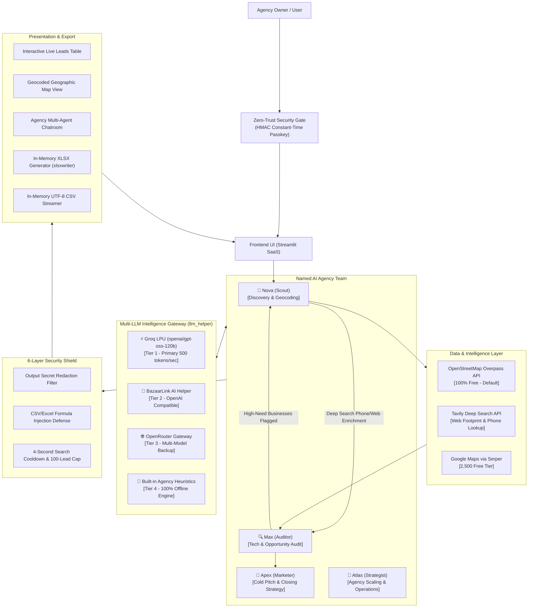
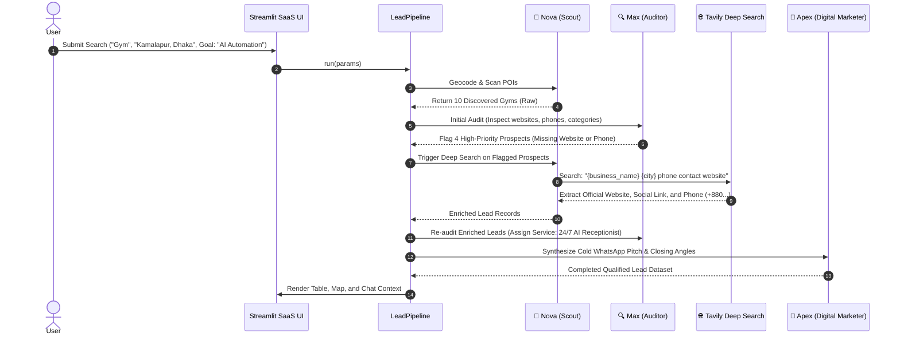

# System Architecture & Technical Specifications (v2.1)

## 1. High-Level Architecture Overview

---

## 2. Technology Stack & Rationale

| Component | Selected Technology | Alternative Considered | Rationale | Cost |
| :--- | :--- | :--- | :--- | :--- |
| **Language** | Python 3.11 - 3.14 | TypeScript / Node.js | Fast data processing, rich ecosystem | **$0** (FOSS) |
| **User Interface** | Streamlit | Next.js + React | Zero boilerplate, native live progress, instant memory downloads | **$0** (FOSS) |
| **Primary AI Engine** | **Groq LPU** (`openai/gpt-oss-120b`) | OpenAI GPT-4o / Anthropic | 500+ tokens/sec, sub-second latency, generous free tier | **$0** (Free Tier) |
| **Helper AI** | BazaarLink AI (`api.bazaarlink.ai/v1`) | Local Ollama | Fast OpenAI-compatible assistant | **$0** (Free Tier) |
| **Deep Search** | Tavily Search API | Direct HTML Scraping | High-accuracy business footprint, contact & phone lookup | **$0** (1k Free/mo) |
| **Free Map Data** | OpenStreetMap (Overpass + Nominatim) | Direct Google Scraping | Legal, stable, unmetered, keyless | **$0** (FOSS) |
| **Spreadsheet Engine**| `xlsxwriter` | SheetJS | High performance Excel generation with styling, auto-width, frozen headers | **$0** (FOSS) |
| **Security Shield** | `hmac`, regex redaction, formula escaping | Cloudflare WAF | Built-in zero-trust passkey, anti-injection, and rate-limiting | **$0** (Native) |
| **Hosting Target** | Streamlit Community Cloud / Render Free | AWS / GCP Paid | 100% free hosting forever, custom domains, free SSL | **$0** |

---

## 3. Collaborative Dual-Agent Handshake Loop

---

## 4. Multi-Layer Security Architecture

### 4.1. Zero-Trust Access Gatekeeper
- Validates user input against `APP_ACCESS_PASSWORD` using `hmac.compare_digest()` to prevent timing attacks.
- If password is unset in `.env`, application runs in open development mode.

### 4.2. Automated Output Redaction Filter
- Intercepts all LLM and agent outputs before rendering to the client browser.
- Automatically redacts regex patterns for `gsk_`, `tvly-`, `sk-or-`, `sk-bl-`, and Bearer tokens.

### 4.3. Spreadsheet Formula Injection Defense
- Every text cell exported to `.xlsx` or `.csv` is inspected by `sanitize_formula_injection()`.
- Prepends a single quote `'` to any cell starting with `=`, `+`, `-`, `@`, `|`, `\t`, or `\r`.

### 4.4. Memory & DoS Shield (512MB RAM Cap)
- Hard clamp enforcing maximum limit of 100 leads per query.
- 4-second minimum search cooldown per user session.
- Explicit `gc.collect()` and buffer dereferencing upon file streaming.
