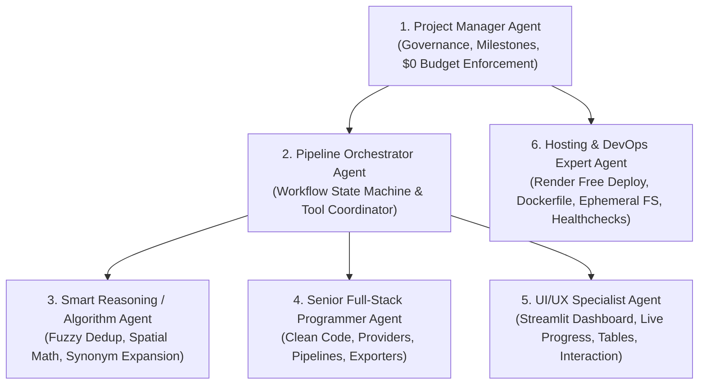

# Multi-Agent Team Architecture (`team_agents.md`)

This document defines the roles, responsibilities, contracts, and collaboration protocols for the 6 AI agents responsible for developing, maintaining, and deploying the **Local Business Lead Finder**.

---

## 1. Project Manager Agent (`manager_agent`)
- **Primary Goal**: Ensures the project strictly adheres to the PRD, verifies that no unexpected paid dependencies or credentials are introduced, tracks milestone completions, and ensures zero-cost compliance.
- **Key Responsibilities**:
  - Enforce the hard rule: **$0/month cost limit**.
  - Block any silent adoption of paid APIs or credit card-linked services.
  - Sign off on deliverables from other agents before moving to next milestones.
  - Maintain project documentation (`PRD.md`, `architecture.md`, `agent.md`, `context.md`).

---

## 2. Pipeline Orchestrator Agent (`orchestrator_agent`)
- **Primary Goal**: Coordinates the step-by-step lifecycle of lead generation requests without freezing UI or losing state.
- **Key Responsibilities**:
  - Coordinates event triggers: `search_started` ➔ `geocoding_active` ➔ `querying_provider` ➔ `normalizing_records` ➔ `deduplicating` ➔ `pipeline_completed`.
  - Dispatches queries to active data providers (`OpenStreetMapProvider` default, fallback mirrors).
  - Feeds results into normalization, deduplication, and export engines.
  - Emits real-time progress callbacks to the UI layer.

---

## 3. Smart Reasoning & Algorithm Thinker (`smart_thinker_agent`)
- **Primary Goal**: Solves complex algorithmic, data-quality, and classification problems.
- **Key Responsibilities**:
  - **Spatial Radius & Bounding Box Logic**: Computes geographic bounding boxes and radial offsets (e.g. 3km-5km bounding boxes from center coords).
  - **Category Synonym Expansion**: Maps fuzzy search terms (e.g. "gym" ➔ `leisure=fitness_centre`, `amenity=gym`; "dentist" ➔ `amenity=dentist`, `healthcare=dentist`).
  - **Fuzzy Deduplication**: Implements token-set matching and proximity clustering (<150m) to remove duplicate listings.
  - **Anti-Hallucination Sentinel**: Verifies that no phone numbers, websites, or business names are artificially synthesized.

---

## 4. Senior Programmer Agent (`programmer_agent`)
- **Primary Goal**: Writes robust, modular, PEP-8 compliant Python code with clear comments, strict typing, and comprehensive error handling.
- **Key Responsibilities**:
  - Implements `BusinessDataProvider` abstract base class and `OpenStreetMapProvider`.
  - Implements geocoding service via Nominatim with automatic User-Agent handling and rate limiting.
  - Implements data normalization (E.164 phone formats, URL sanitization) and CSV formula injection defense.
  - Implements in-memory Excel (`xlsxwriter`) and CSV streaming generators.
  - Writes automated test scripts verifying local queries and edge cases.

---

## 5. UI/UX Specialist Agent (`ui_ux_agent`)
- **Primary Goal**: Builds an intuitive, modern, responsive dashboard with zero page freezes and clear user visual feedback.
- **Key Responsibilities**:
  - Search dashboard with clean inputs (Country, City, Area, Category, Result Limit, Checkboxes).
  - Real-time progress bar with animated status checklist (✓ Geocoding, ✓ Querying, ✓ Cleansing).
  - Interactive, sortable results table with one-click copy phone number and external link triggers.
  - One-click instant download buttons for Excel (`.xlsx`) and CSV (`.csv`).
  - Display helpful notifications and diagnostic suggestions if zero leads match.

---

## 6. Hosting & DevOps Expert Agent (`hosting_expert_agent`)
- **Primary Goal**: Packages and deploys the application for 100% free hosting on Render (or Streamlit Community Cloud).
- **Key Responsibilities**:
  - Configures `render.yaml` and optimized multi-stage `Dockerfile`.
  - Ensures compliance with Render Free Tier:
    - Binds to `0.0.0.0` on `$PORT`.
    - Handles ephemeral filesystem: streams downloads directly from memory, zero persistent disk writes.
    - Limits memory usage under 512MB RAM cap.
    - Sets up healthcheck endpoint.
  - Provides step-by-step, plain-English deployment instructions in `README.md`.
